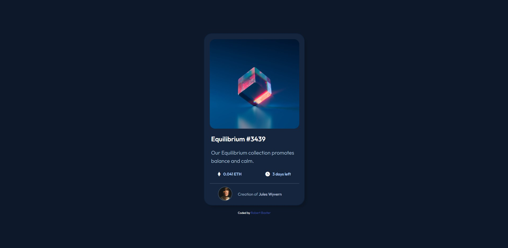

# NFT preview card component

This is a solution to the [NFT preview card component challenge on Frontend Mentor](https://www.frontendmentor.io/challenges/nft-preview-card-component-SbdUL_w0U). Frontend Mentor challenges help you improve your coding skills by building realistic projects. 

## Overview

### Inital Design

### The Challenge

Build out the NFT preview card component and get it looking as close to the design as possible.

Users should be able to:

- View the optimal layout depending on their device's screen size
- See hover states for interactive elements

### My First Page Iteration

I blocked out the card and page using HTML and CSS, using the client-specified colours.

I attempted to get it as close to the design preview as possible using a variety of things, such as: CSS selectors, flexbox, and more.

## Link To Live Demo

- Live Site URL: [Add live site URL here](https://Live-site-url.com)

### Built with

- Semantic HTML5 markup
- CSS custom properties
- Flexbox
- CSS Grid

## Author

- Robert Baxter - [robert-baxter](https://www.robertbaxter.design)
